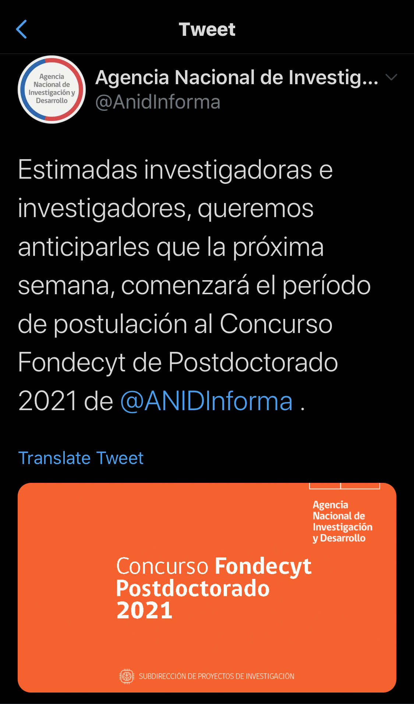

# Postdoctoral position supported by Fondecyt-Chile

If you are interested in a postdoc in my group, you can apply to the Postdoctoral program supported by FONDECYT-Chile. **[Send me an email](mailto:cseljatib@gmail.com) if you are interested**, and we can discuss research alternatives, as well as other details.

You can review further info about the call in the ANID website
* The Chilean National Science Foundation ["ANID"](https://www.anid.cl)
* About the past call, the one to be opem should be quite similar. [Check it out](https://www.anid.cl/concursos/concurso/?id=281)
* Forms to be fullfilled. Check the files from last year [here](https://s3.amazonaws.com/documentos.anid.cl/postdoctorado/2020/fallo/Descargables_espanol.zip)

