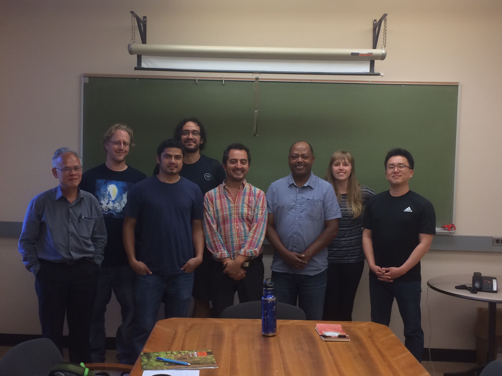
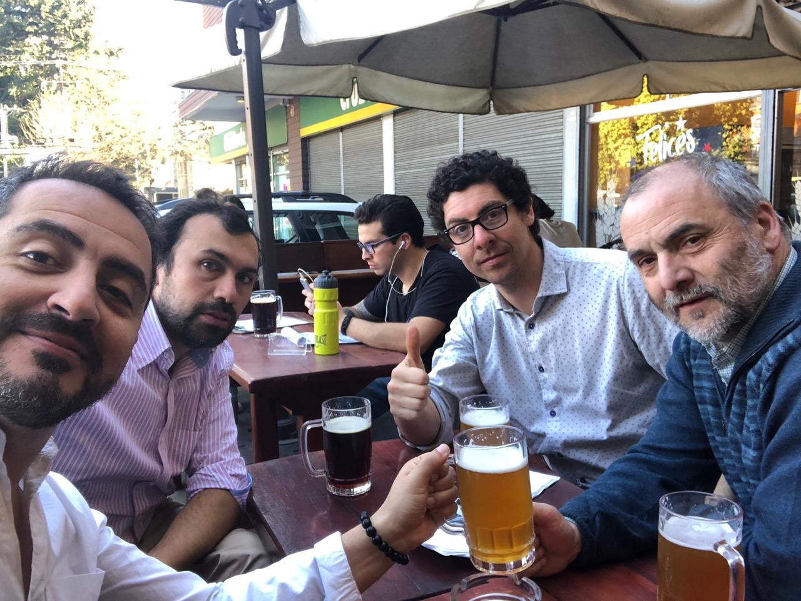

## In Chile

* *Pablo Donoso*, Professor of Silviculture, Universidad Austral de Chile, Valdivia, Valdivia.
* *Rodrigo Vargas*, Assistant Professor of Restoration, Universidad de La Frontera, Temuco.
* *Daniel Soto*, Assistant Professor of Silviculture, Universidad de Aysen, Coyhaique.
* *Andrés Fuentes*, Assistant Professor of Fire Ecology, Universidad de La Frontera, Temuco.
* *Juan Pablo Fuentes*, Associate Professor of Soil Ecology, Universidad de Chile, Santiago.

## Abroad

* *Aaron Weiskittel*, Professor of Biometrics, University of Maine, USA.
* *Timothy G. Gregoire*, Professor of Biometrics and Environmental Statistics, Yale University, USA.
* *Hailemariam Temesgen*, Professor of Biometrics, Oregon State University, Corvallis, USA.
* *Lauri Mehtätalo*, Professor Biometrics at the Universty of Eastern Finland, Joenssu, Finland.

With Aaron in southern Chile  (2017)

With Hailemariam's group in Corvallis (2016)

With Andres, Rodrigo, and Pablo in Temuco (2018)

