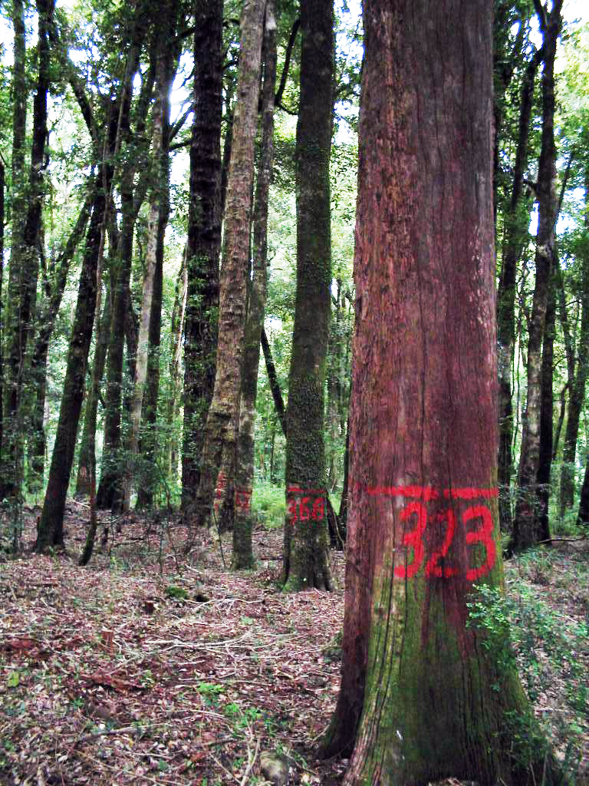

Este sitio web provee información relacionada al libro **Análisis de datos con el programa estadístico R: una introducción aplicada**

Más adelante encontrarás aquí mayores antecedentes, sin embargo, por ahora queda a disposición el paquete **datana** donde estan todos los datos y funciones ocupadas en el libro. Tu puedes por lo tanto descargarlo e instalarlo en tu versión de R.

## Fuente del paquete y manual
+ [**datana_0.1.tar.gz**](/libroR/datana_0.1.tar.gz)
+ [**datana.pdf**](/libroR/datana.pdf)

## Archivos de datos y otros
El paquete contiene una gran cantidad de dataframe disponibles. Cada una de ella se encuentran detalladas en el documento [**biometria.pdf**](/libroR/datana.pdf). Sin embargo, los siguientes archivos "físicos", son necesarios para algunos pasajes del libro.

+ [bearsFull.dat](/libroR/bearsFull.dat)
+ [eucaLeaf.dat](/libroR/eucaLeaf.dat)
+ [fertiliza.csv](/libroR/fertiliza.csv)
+ [fvsSim.xls](/libroR/fvsSim.xls)
+ [mycontrast.R](/libroR/mycontrast.R)
+ [snaspe09.dbf](/libroR/sanaspe09.dbf)
+ [ufcData.csv](/libroR/ufcData.csv)

## Comentarios/sugerencias?
Cualquier duda, comentario o sugerencia, no dudes en contactarme [vía e-mail](mailto:cseljatib@gmail.com), mis correos son cseljatib@gmail.com y/o también christian.salas@aya.yale.edu.

<!-- ### Footer

Last updated: August 2020 -->