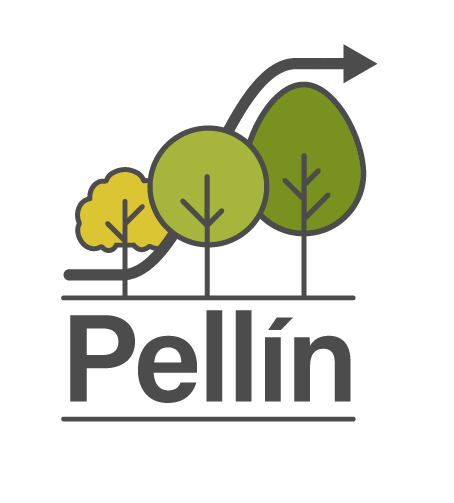

**Bienvenidos a Pellín, un simulador
de crecimiento de bosques nativos!**

## Introducción

Pellín es un simulador de crecimiento de bosques nativos, esto es un sistema de ecuaciones matemático-estadísticas que predice
el crecimiento de bosques naturales en Chile. En específico, esta versión es desarrollada para bosques secundarios dominados por *Nothofagus obliqua* (roble), *N. alpina* (raulí), y *N. dombeyi* (coihue) en el centro-sur de Chile.

## El modelo
Pellín es un modelo de simulación a nivel de árbol individual independiente de la distancia. 
 El modelo se basa en un trabajo de modelación que se ha venido llevando a cabo bajo la dirección del Profesor [Christian Salas-Eljatib](https://eljatib.com) y con la colaboración de un [equipo](./team.html) de co-investigadores y asistentes de investigación.

## Simular

Para simular en Pellín se recomienda lo siguiente

1. Leer el [manual del usuario](manualPellin.pdf)

2. Luego de lo anterior, ingresar al siguiente [enlace](https://biometriabosques.shinyapps.io/Pellin01/) 

Mayores detalles técnicos son entregados en  la sección [Documentos](./docs.html) del presente sitio.
 

<!--- 
https://www.andreashandel.com/posts/github-website/
**Some of my older websites**
Pellín: un simulador de crecimiento de bosques nativos

output: 
  html_document:
    toc: FALSE
-->
