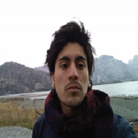
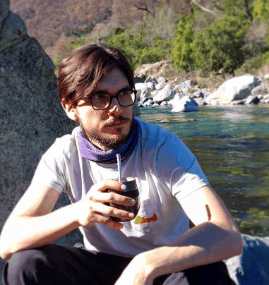

--------

* **[Mi laboratorio](#mi-laboratorio)** 
* **[Colaboradores de investigacion](./collabora.md)**
* **[Alumni](./alumni.md)** 
* **[Mentores](./mentors.md)** 

--------

## Mi laboratorio

|   |   |   | 
|---|---|---|
| [*Renato Cifuentes*](https://www.researchgate.net/profile/Renato_Cifuentes)  |Ph.D. Sensores remotos   |   |   
| *Joaquín Riquelme*  |Ing. en Rec. Naturales, Magister   |   | 
|  *Nicolas Pino* | Ing. Civil Matematico  |   | 
|---|---|---|

--------

__Estudiantes__

|   |   |   |
|---|---|---|
|*Rodolfo Mendez*  | B.S. in Forest Engineering, Universidad de Chile (Santiago, Chile)   |   |
|*Sergio Henriquez*  | B.S. in Biology, Pontifica Universidad Catolica (Santiago, Chile)   |   |
|---|---|---|

--------

<!-- ### Footer
Former students, post-docs, and visiting students..  Furthermore, I have listed former students at various levels, conditions, and institutions. Besides, a link to my current research collaborators. 
Our lab investigates how forest ecosystems change through time. We use both mathematical, theoretical, statistical and empirical approaches to address several research questions related to the development of forests; tree allometry; the scaling of tree-level processes to ecosystems; and the building of forest growth model. Our research also includes the long-term monitoring of the temperate forests in southern Chile.
{width=200px height=200px}

{:height="36px" width="36px"}
__Postdoc__
* *Renato Cifuentes*, Ph.D.
__Research assistants__
* *Joaquín Riquelme*, Natural Resources Engineer, M.S.
* *Nicolas Pino*, Mathematical Engineer.
__Visiting graduate students__
* *Patricio Ojeda*, Doctoral program in Forest Sciences, Universidad Austral de Chile (Valdivia, Chile)
{ width=50%}

Last updated: August 2020 -->
